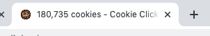
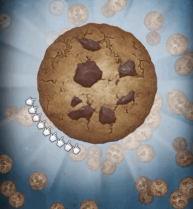

# Workshop: Cookie Clicker

This workshop challenges you to build an **idle game**.

An idle game is a game that involves very little active gameplay, and mostly a lot of waiting around for resources to grow. The most famous example of an idle game is [cookie clicker](https://orteil.dashnet.org/cookieclicker/), so we'll create a simple clone of that game.

The game features a cookie that can be clicked; every click yields 1 cookie. You can use cookies to buy resources that purchase cookies automatically for you.

Here's a finished working demo:


## Exercise 1: Finishing the UI

First, let's take a look at the structure. We'll find React Router in our `App` component.

There are two routes, our root `/` that renders `Home`, and `/game` which renders `Game`. We'll focus mostly on `Game`.

Our `Game` file has an array of items:

```js
const items = [
  { id: 'cursor', name: 'Cursor', cost: 10, value: 1 },
  { id: 'grandma', name: 'Grandma', cost: 100, value: 10 },
  { id: 'farm', name: 'Farm', cost: 1000, value: 80 },
];
```

`cost` is how many cookies the items cost. `value` is how many cookies the item generates per second.

You can see that we aren't using this data anywhere yet, and we have a TODO in our component:

```js
<ItemArea>
  <SectionTitle>Items:</SectionTitle>
  {/* TODO: Add <Item> instances here, 1 for each item type. */}
</ItemArea>
```

Create a new `<Item>` component in a new file, `Item.js`. To start, create the markup from the gif above using a hardcoded item (you can pick the first item from the `items` array in `data.js`). Once you have it rendering correctly, swap out the hardcoded values for props (eg. change `<Name>Cursor</Name>` to `<Name>{name}</Name>`, with `name` being defined in the component props).

In our `Game` component, map over the `items` array, and create 1 `<Item>` component for each item, passing in the right props.

There are two additional "special" props we need: `numOwned` and `handleClick`.

`numOwned` will tell the component how many of this item are currently owned by the player, and will be displayed as a big number on the right side. For now, you can use the `purchasedItems` object in the Game component; we'll replace this with React state shortly.

For `handleClick`, we want to pass a function. For now it can just log to the console; we need to add state for this to work.

## Exercise 2: Adding state

At the top of our `Game` component, we have two static pieces of data:

```js
// TODO: Replace this with React state!
const numCookies = 100;
const purchasedItems = {
  cursor: 0,
  grandma: 0,
  farm: 0,
};
```

We want this data to be _dynamic_, so we'll need to use React state via a `useState` hook.

First, let's do `numCookies`. Here's what we want:

- `numCookies` should come from a state hook
- Clicking the cookie `<Button>` should increment it by 1
- That value should be shown in the UI (at the top, inside `<Indicator>`)

Implementing this is left as an exercise (if you're feeling lost, check out previous workshops for a refresher on how `useState` works!).

Next, `purchasedItems`. This will also need to use a state hook.

That `handleClick` method we added for `Item` needs to do a few things:

- Check if the user can afford the item being clicked. If not, throw a `window.alert` and return early.
- Otherwise, deduct the appropriate number of cookies from `numCookies`, and add the item count to `purchasedItems`.

In other words, here's the transformation that should happen:

```diff
// Let's say this is our initial state:
numCookies = 100;
purchasedItems = {
  cursor: 0,
  grandma: 0,
  farm: 0,
};

The `cursor` item costs 10 cookies:
  { id: 'cursor', name: 'Cursor', cost: 10, value: 1 },

If we buy a `cursor`, we should end up with this new state:

numCookies = 90;
purchasedItems = {
  cursor: 1,
  grandma: 0,
  farm: 0,
};

You can see that 1 cursor has been added to `purchasedItems`,
and 10 cookies have been deducted from `numCookies`
```

_HINT:_ You'll need to have 2 separate state hooks. One for `numCookies` and one for `purchasedItems`. This means that when you buy an item, you'll need to call 2 separate setter functions.

_HINT:_ When using an object as the state, you'll need to be careful not to overwrite other state values. For example, don't do this:

```
setPurchasedItems({ cursor: 1 })
```

If you do this, you'll accidentally delete the `grandma` and `farm` items! Instead, you can use the "spread" operator:

```
const o = { apple: 10, banana: 2 }

const updatedO = {
  ...o,
  banana: 4,
}

console.log(updatedO); -> { apple: 10, banana: 4 }
```

## Exercise 3: Passive cookie generation

We need to add a hook to update our `numCookies` once every second.

Unfortunately, using `setInterval` with hooks is somewhat complicated. To solve for this complexity, a `useInterval` hook is provided in `src/hooks/use-interval.hook`. Import it, and add the following code:

```js
useInterval(() => {
  const numOfGeneratedCookies = calculateCookiesPerTick(purchasedItems);

  // Add this number of cookies to the total
}, 1000);
```

You'll need to write the `calculateCookiesPerTick` function yourself. This will require some data munging, since you need to iterate through each type of item, and figure out the total value of the items you have. For example, if you have 3 cursors and 1 farm, your total cookies per tick is 83 (1 × 3 + 80 × 1).

Once this is working, you should see the `numCookies` being shown auto-incrementing, once you purchase an item.

Also, we want to show that "cookies-per-second" within the `<Indicator>` component, below the total number of cookies.

> NOTE: Because we're rendering it in the code, you might think that you want to store `cookiesPerSecond` in state. This is a bad practice, though, because this is _derived data_. The # of cookies/second can be calculated from the `purchasedItems` bit of state. If we had a `cookiesPerSecond` state hook, we would need to make sure that they were always kept in sync, and bugs could creep in if we change one state hook but not the other.

## Exercise 4: Updating the tab title

The "cookie clicker" game shows your total # of cookies in the tab title:



We can use `useEffect` here! Whenever the `numCookies` state is changed, we want to update `document.title` to reflect this change.

Give this a shot. The solution is shown below.

.

..

...

....

.....

......

.......

......

.....

....

...

..

.

Here's how we do this with `useEffect`:

```js
React.useEffect(() => {
  document.title = `${numCookies} cookies - Cookie Clicker Workshop`;
}, [numCookies]);
```

There's one more problem too. What happens if you click "return home" in the top left, after generating some cookies? The document title remains set to that custom value, but we aren't playing the game anymore! It should revert to "Cookie Clicker Workshop".

To fix this, we can take advantage of the _return callback_, which lets us do cleanup:

```js
React.useEffect(() => {
  document.title = `${numCookies} cookies - Cookie Clicker Workshop`;

  return () => {
    document.title = `Cookie Clicker Workshop`;
  };
}, [numCookies]);
```

The _return callback_ is called whenever `numCookies` is changed, _or_ when the component is unmounting. This means that whenever the number changes, we'll make two calls to `document.title`, but they're close enough together that you'll only see the last one.

Add a console.log to this callback, to deepen your understanding of when it's called.

## Exercise 5: Using the "space" key

Another way that `useEffect` is helpful is when we need to register global event listeners.

Let's say that we want to trigger the same "click" cookie-generation when the user presses the spacebar.

Here's how we would do this, in vanilla JS:

```js
function handleKeydown(ev) {
  if (ev.code === 'Space') {
    // Trigger here
  }
}

window.addEventListener('keydown', handleKeydown);
```

Write a `useEffect` hook that registers an event listener, and triggers the "cookie click" code when the user hits the `Space` key. don't forget to unregister that callback when the component unmounts.

With React components, we always want to _clean up after ourselves_. We can do that with `window.removeEventListener`, as well as the _return callback_ we saw in the previous exercise.

> QUESTION: Why is it important that we clean after ourselves in React components? _HINT:_ without cleaning up, try clicking the "Return home" button, and then pressing the spacebar. Do you see anything in the console?

## Exercise 6: Focusing the first store item on mount

It would be great for keyboard users if the very first item was auto-focused on mount.

As a refresher, here's how to focus an item on mount:

```jsx
const App = () => {
  const ref = React.useRef(null);

  React.useEffect(() => {
    ref.current.focus();
  }, []);

  return (
    <>
      <button ref={firstNameRef} />
    </>
  );
};
```

In our case, it's a bit trickier since we're rendering multiple items and we only want to auto-focus the very first one!

Here's a hint: Write a new hook inside `Item`. You can add a new prop to `Item` to tell it whether this particular item is the first item in the list or not. If the item is the first, you can trigger the focus. Otherwise, do nothing.

Remember, **you cannot use hooks conditionally**. This won't work:

```js
if (someParam) {
  React.useEffect(() => {
    // stuff
  });
}
```

Instead, you need to do this:

```js
React.useEffect(() => {
  if (someParam) {
    // stuff
  }
});
```

# STRETCH GOALS

## Stretch goal 1: Custom hooks

We defined a few pieces of behaviour in our app that could potentially be reused. Let's refactor our code to extract generic logic into reusable hooks.

Create the following hooks:

- `useKeydown`
- `useDocumentTitle`

`useKeydown` should take two arguments: `code`, the key to track, and `callback`, some code to run when that key is pressed.

`useDocumentTitle` should take two arguments: `title` and `fallbackTitle`. Whenever `title` changes, it should be set as the document title. `fallbackTitle` should be used as cleanup.

## Stretch goal 2: Increasing cookies per click

In Cookie Clicker, there are two kinds of items:

- Items that increase the # of cookies per tick
- Items that increase the # of cookies per click

Right now, we've implemented the second type, but not the first. No matter what we purchase, we always earn exactly 1 cookie per click.

Add a new item type, `megaCursor`, which increases the # of cookies per click. You'll need to do some re-working of the game logic and the data format for this to work!

## Stretch goal 3: Increased pricing

In Cookie Clicker, each time you buy an item, it gets more expensive; The first cursor might only cost 10 cookies, but the second one might cost 12, and then 15, and then 20. The growth rate is _non-linear_; the price doesn't go up by 2 cookies every time, for example. Instead the jump gets higher and higher with every purchase.

Implement this!

## Stretch goal 4: Add whimsy

The Cookie Clicker game features a lot of animations, representing the cookies being earned, including cursors that rotate around the cookie, and raining background cookies:



There are a number of cool directions you can take this! Some ideas:

- Add falling cookies in the background by creating divs and using `transform: translate` to move them across the screen. For performance reasons, you should cap this to 10-20 at once. Some of the tricks from nyan-cat might come in handy!
- Add cursors rotating around the cookie. You can use `transform: rotate`, though you'll need to offset the cursors so that they aren't spinning in the center of the cookie!
- Anything else you think would be fun!
