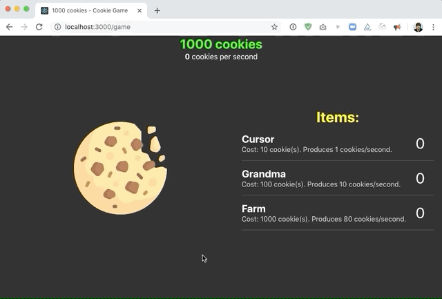

# Workshop: Cookie Clicker

This workshop challenges you to build an **idle game**.

An idle game is a game that involves very little active gameplay, and mostly a lot of waiting around for resources to grow. The most famous example of an idle game is [cookie clicker](https://orteil.dashnet.org/cookieclicker/), so we'll create a simple clone of that game.

The game features a cookie that can be clicked; every click yields 1 cookie. You can use cookies to buy resources that purchase cookies automatically for you.

Here's a finished working demo:

---

## Exercise 1: Finishing the UI

Open this exercise file: [exercise-1.md](__workshop/exercise-1.md)

## Exercise 2: Adding State

Open this exercise file: [exercise-2.md](__workshop/exercise-2.md)

## Exercise 3: Passive cookie generation

Open this exercise file: [exercise-3.md](__workshop/exercise-3.md)

## Exercise 4: Updating the Tab Title

Open this exercise file: [exercise-4.md](__workshop/exercise-4.md)

## Exercise 5: Using the "space" Key

Open this exercise file: [exercise-5.md](__workshop/exercise-5.md)

## Exercise 6: Focusing the first store item on mount

Open this exercise file: [exercise-6.md](__workshop/exercise-6.md)

## Exercise 7: Custom hooks

Open this exercise file: [exercise-7.md](__workshop/exercise-7.md)

---

🟡 - Minimally complete workshop (75%) - 🟡

---

## Exercise 8: Increasing cookies per click

Open this exercise file: [exercise-8.md](__workshop/exercise-8.md)

## Exercise 9: Increased pricing

Open this exercise file: [exercise-9.md](__workshop/exercise-9.md)

---

🟢 - Complete workshop (100%) - 🟢

---

## Exercise 10: Add whimsy

Open this exercise file: [exercise-10.md](__workshop/exercise-10.md)
